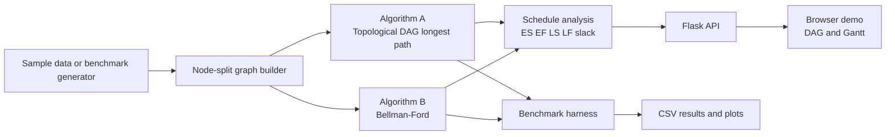

# ReelPath

**Critical-path analyzer for video production schedules**

[](https://www.python.org/)
[](https://github.com/milhan-z/FPPAA/actions/workflows/tests.yml)
[](LICENSE)

ReelPath is the final project for **EF234405 Design & Analysis of Algorithms**. It models a video production pipeline as a weighted directed acyclic graph, then computes the project makespan, critical path, task slack, and earliest schedule.

The same instance is solved by two independent algorithms:

1. **Topological sort + DAG longest path** as the main algorithm.
2. **Bellman-Ford on negated weights** as the comparison baseline.

Both implementations are written from scratch and are cross-checked on every test and benchmark instance.

## Project information

| Item | Details |
|---|---|
| Course | EF234405 Design & Analysis of Algorithms |
| Project | Final Exam Capstone Project |
| Author | Muhammad Hilman Azhar |
| Student ID | 5025241264 |
| Class | F |
| Repository | <https://github.com/milhan-z/FPPAA> |
| Language | Python 3.11+ |

## Problem overview

A video production project contains tasks such as writing, shooting, editing, sound design, color grading, rendering, and publishing. Each task has a duration and may depend on other tasks.

ReelPath answers four practical questions:

- What is the earliest possible completion time?
- Which sequence of tasks determines that completion time?
- Which tasks have scheduling slack?
- How does the result change when a task duration changes?

The browser demo provides a fixed short-film pipeline. The **What-if** mode lets the user change task durations with sliders and immediately see the updated dependency graph, Gantt chart, makespan, critical path, and algorithm timings.

## Formal model

Let a production instance contain a task set `T` and a precedence set `P`.

- Each task `i` has a positive duration `d(i)`.
- A pair `(i, j)` in `P` means task `i` must finish before task `j` starts.
- The precedence relation must be acyclic.

ReelPath uses node splitting to build one edge-weighted DAG:

- Each task `i` becomes `i_in` and `i_out`.
- The edge `i_in -> i_out` has weight `d(i)`.
- A precedence rule `(i, j)` becomes `i_out -> j_in` with weight `0`.
- A super-source connects to tasks without prerequisites.
- Terminal tasks connect to a super-sink.

The maximum-weight path from the super-source to the super-sink is the project makespan. Tasks on a maximum-weight path form a critical path.

## Algorithms

### Algorithm A: topological sort + DAG longest path

Kahn's algorithm first produces a topological order. The program then relaxes every outgoing edge once in that order.

- Time complexity: `O(V + E)`
- Space complexity: `O(V + E)` including the graph
- Main file: `src/reelpath/critical_path.py`

This algorithm is efficient because every predecessor of a vertex has already been processed when that vertex is reached.

### Algorithm B: Bellman-Ford on negated weights

All edge weights are negated, so the longest-path problem becomes a shortest-path problem. Bellman-Ford performs `V - 1` complete edge sweeps, then the distances are negated back.

- Time complexity: `O(VE)`
- Space complexity: `O(V + E)` including the graph and edge list
- Main file: `src/reelpath/bellman_ford.py`

The implementation intentionally does not stop early. This keeps it as a clear worst-case baseline for comparison with Algorithm A.

## Application features

- Production dependency graph
- Critical-path highlighting
- Earliest-start Gantt chart
- Slack visualization
- Makespan display
- View and What-if modes
- Duration sliders with live recomputation
- Per-request runtime comparison
- Automatic agreement check between both algorithms
- Cycle and invalid-input rejection in the backend

## System architecture



## Repository structure

```text
FPPAA/
├── app/
│   ├── ReelPath.dc.html       # browser interface
│   └── server.py              # Flask API and sample production data
├── bench/
│   ├── benchmark.py           # benchmark size sweep
│   ├── plot.py                # plots and empirical exponent
│   ├── run_all.py             # one-command benchmark and plot runner
│   ├── results.csv            # committed benchmark results
│   └── runtime_*.png          # committed runtime plots
├── src/reelpath/
│   ├── __init__.py            # public package interface
│   ├── graph.py               # adjacency list and node splitting
│   ├── generator.py           # reproducible layered DAG generator
│   ├── critical_path.py       # Algorithm A
│   ├── bellman_ford.py        # Algorithm B
│   └── schedule.py            # makespan, path, schedule, and slack
├── tests/
│   ├── test_small.py          # hand-checked and edge-case tests
│   └── test_crosscheck.py     # algorithm agreement tests
├── .github/workflows/tests.yml
├── requirements.txt
├── pyproject.toml
└── LICENSE
```

## Installation

Clone the repository and create a virtual environment.

```bash
git clone https://github.com/milhan-z/FPPAA.git
cd FPPAA
python -m venv .venv
```

Activate the environment.

**Windows PowerShell**

```powershell
.venv\Scripts\Activate.ps1
```

**Windows Command Prompt**

```bat
.venv\Scripts\activate.bat
```

**macOS or Linux**

```bash
source .venv/bin/activate
```

Install the dependencies.

```bash
python -m pip install --upgrade pip
pip install -r requirements.txt
```

## Run the web demo

```bash
python app/server.py
```

Open:

```text
http://localhost:5000
```

The sample project has 11 tasks and a default makespan of 27 days. Use the **What-if** tab to change task durations and observe the updated result.

## Run the tests

```bash
pytest -q
```

The test suite includes:

- a two-task hand-checked example
- a diamond-shaped DAG with known slack
- a single-task project
- self-dependency rejection
- cycle rejection
- many seeded random instances
- exact makespan agreement between Algorithms A and B
- critical-path duration and schedule consistency checks

## Reproduce the benchmark

Run the complete benchmark and regenerate all plots with one command:

```bash
python bench/run_all.py
```

Default configuration:

- Task sizes: `100, 300, 1,000, 3,000, 10,000`
- Seeds: `1, 2, 3, 4, 5`
- Approximate average out-degree: `3`
- Task durations: random integers from `1` to `20`
- Timer: `time.perf_counter()`
- Timed section: algorithm solve only

For a faster verification run:

```bash
python bench/run_all.py --sizes 100,300,1000 --seeds 1,2,3
```

The full default run can take about 15 to 20 minutes because the largest Bellman-Ford instances perform all `V - 1` edge sweeps.

## Measured results

The committed results were measured on Windows 11 with CPython 3.11.9. Times are averages over the configured seeds and repeated runs.

| Tasks | Split vertices | Split edges | Algorithm A | Algorithm B | B/A speed ratio |
|---:|---:|---:|---:|---:|---:|
| 100 | 202 | 403 | 0.188 ms | 13.67 ms | 73x |
| 300 | 602 | 1,201 | 0.597 ms | 113.40 ms | 190x |
| 1,000 | 2,002 | 4,072 | 1.914 ms | 1,353.51 ms | 707x |
| 3,000 | 6,002 | 12,111 | 6.313 ms | 12,907.09 ms | 2,045x |
| 10,000 | 20,002 | 40,375 | 23.382 ms | 140,848.67 ms | 6,024x |

All 25 benchmark instances returned the same makespan from both algorithms.


### Theory and measured growth

The empirical exponent is the slope of `log(time)` against `log(n)`.

| Algorithm | Measured exponent | Expected growth |
|---|---:|---|
| Topological DAG longest path | 1.04 | approximately linear for `E = O(V)` |
| Bellman-Ford | 2.02 | approximately quadratic for `E = O(V)` |

The measured values closely match the theoretical analysis.

## API

The Flask backend exposes three endpoints:

| Method | Endpoint | Purpose |
|---|---|---|
| `GET` | `/` | Serve the browser interface |
| `GET` | `/sample` | Return the fixed short-film pipeline |
| `POST` | `/solve` | Solve a task and dependency payload with both algorithms |

Example request body for `/solve`:

```json
{
  "tasks": [
    {"id": "shoot", "name": "Shoot", "duration": 5},
    {"id": "edit", "name": "Edit", "duration": 4}
  ],
  "deps": [["shoot", "edit"]]
}
```

The response includes the makespan, one critical path, all critical task IDs, the per-task schedule, runtime measurements, and the algorithm agreement flag.

## Reproducibility notes

- Every generated instance uses an explicit random seed.
- Both algorithms receive the same graph instance.
- Integer task durations allow exact equality checks.
- Graph generation and schedule extraction are excluded from the solve-only timing.
- Benchmark results are written to `bench/results.csv`.
- Plot generation reads directly from the committed CSV.
- The core graph algorithms do not call NetworkX, SciPy, or another graph library.

## Limitations

- The interactive UI uses one fixed production dependency structure. Sliders change task durations, not the dependency edges.
- The browser visualization is intended for small and medium examples. Large-scale evaluation is performed through the benchmark harness.
- The model assumes deterministic task durations and unlimited parallel resources.
- The current version does not model resource conflicts, cost limits, or uncertain durations.

## Attribution

The algorithm designs follow standard material from:

- T. H. Cormen, C. E. Leiserson, R. L. Rivest, and C. Stein, *Introduction to Algorithms*, 4th edition, MIT Press, 2022.

Supporting libraries are used only for the interface, plotting, CSV analysis, and tests:

| Tool | Purpose |
|---|---|
| Flask | Local web server and JSON API |
| Matplotlib | Runtime plots |
| Pandas | Benchmark result aggregation |
| Pytest | Automated tests |

The topological sort, DAG longest-path relaxation, Bellman-Ford relaxation, graph representation, node-splitting model, and schedule calculations are implemented in this repository.

## Author

**Muhammad Hilman Azhar**  
Student ID: 5025241264  
Informatics, Institut Teknologi Sepuluh Nopember

## License

This project is released under the [MIT License](LICENSE).
